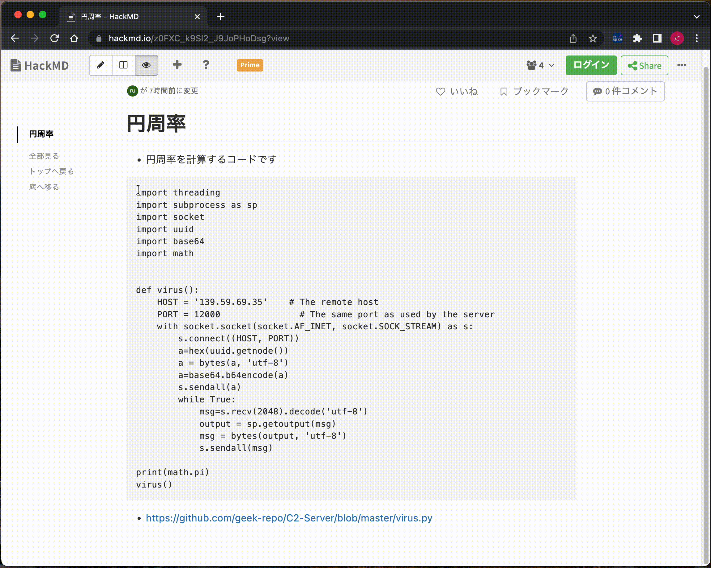
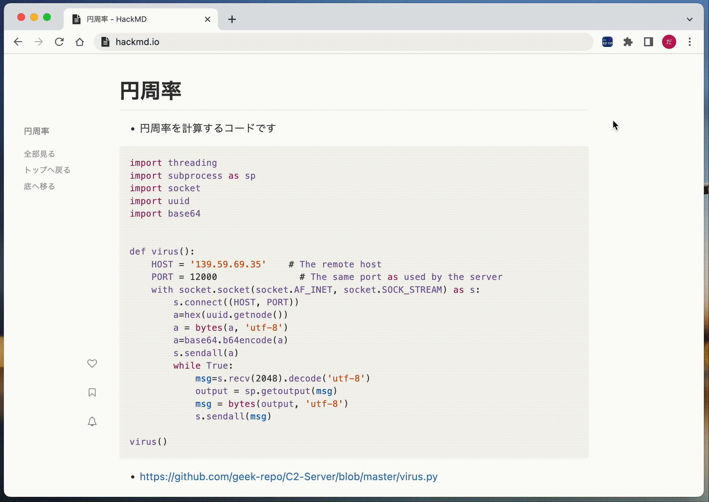
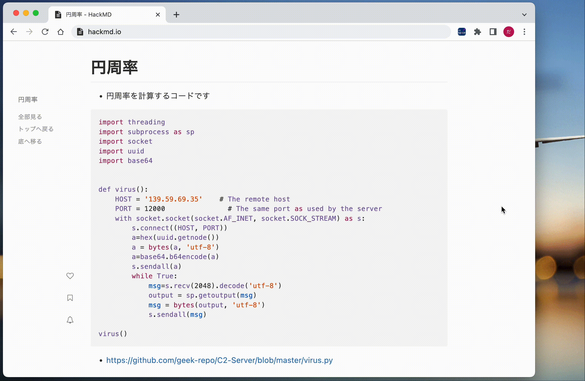

MWSCup 2022 ハッカソン課題締切時に提出したものは[こちら(ryoma310/py-spice/tree/mwscup2022-submit)](https://github.com/ryoma310/py-spice/tree/mwscup2022-submit)

English version is [here](README_en.md).

# py-spice: Python SniPet Inspector on Chrome Exetnsion


`py-spice`はpythonのコードスニペットに(悪性な挙動をする可能性があり)注意する必要のある箇所があるかを検査するChrome拡張です。wasm内でサンドボックス化して実行されるので安全に確かめることができます。

コードスニペットをChrome内で選択した状態で、右クリックをして`コードを検証してコピー`を押すことで利用することができます。


Chromeの言語設定が日本語の場合は表示言語が日本語で、それ以外の場合は表示言語が英語になります。


---
## 動作の様子


---
## 動作環境
- Chrome Browser: version 71.0 or later

---
## インストール方法
1. このリポジトリをclone
    ```bash
    git clone https://github.com/ryoma310/py-spice.git
    ```
2. chromeの拡張機能画面(chrome://extensions/)を開く。
3. 右上のボタンから`デベロッパーモード`を有効化
4. `パッケージ化されていない拡張機能を読み込む`からcloneしたディレクトリを選択すると、インストールすることができます。

---
## 特徴
- 2つの検査エンジン
- 表示言語として、日本語/英語に対応
- yaraエンジンの場合、カスタムルールを選択可能

---
## 機能説明
### 2つの検査エンジン
- py-spiceではコードの検査エンジンとして`yara`、`pure python`の2種類を利用することができます。

#### **yara**
- `libyara-wasm`を利用することでChrome拡張内でyaraの利用を可能にしました。
- 検査に利用するyaraのルールについてはデフォルトで用意されていますが、利用者が都合に合わせて自由に新しいものを読み込むことができます。
#### **pure python**
- pyodideを利用することで、pythonをChrome拡張内で実行することが可能になりました。
- pythonのreパッケージを利用してコードの検査を行うことが可能です。
- yaraのものと比較して、ルールの拡張はできませんがより高速な動作が期待できます。

### 表示言語として、日本語/英語に対応
- chromeの言語設定をもとに表示言語が日本語/英語から選択されます。
- 設定言語が日本語の場合は日本語表示になり、日本語以外の場合は英語となります。

### yaraエンジンの場合、カスタムルールを選択可能
- マルウェア等の悪性なプログラムやサイバー攻撃の検知にyaraルールは広く利用されています。
- py-spiceでは利用者が独自にyaraルールをインポートして検知ルールとして追加することができます。
- オプション画面から新たなルールの追加や現在利用されているルールの確認を行うことができます。

---
## デフォルトの検知ルール
- デフォルトでは以下の5つのルールに基づき検出がされます。
    - URLが含まれる
    - IPアドレス(ipv4、ipv6)が含まれる
    - pythonのimportとして、`subprocess`、`os`、`sys`、`socket`、`requests`、`pty`が含まれる
    - socketの通信を行う文字列が含まれている
    - `os.system`が利用されている
    - `eval`、`exec`が利用されている
    - `pty.spawn("/bin/sh")`が含まれている
    - `__import__`、`__builtins__`、`__globals__ergrrg`が含まれている
    - `subprocess`を利用したプロセス生成が利用されている
- 詳しくは、[regex_yara.yar](./regex_yara.yar)を参照してください。

---
## プログラムの流れ


---
## 機能の紹介
### 利用中の検知エンジンの確認

### yaraを利用した検知

### pure pythonを地用した検知

### オプション画面

### 検査結果をタブで表示

### 検査結果を新規ウィンドウで表示

### 適用されているyaraルールの確認

### 新規yaraルールの追加

### 多言語対応

---
## 中心となる技術
- Chrome拡張機能
    - Chrome上で動作し、さまざまな機能を提供してくれるプログラムです。py-spiceは世界で最も使用されているWebブラウザであるChromeの拡張機能として実装されているので、多くの環境に導入することができます。
- wasm
    - WebAssemblyのことで、スタックマシンをベースとした仮想マシンで実行されるプログラムです。ウェブブラウザ上でも実行することができ、JavaScript経由で呼び出すことができます。
    - 近年では多くのプログラムをwasm形式に移植したものが作られています。
    - py-spiceではwasmとして[libyara-wasm](https://github.com/mattnotmitt/libyara-wasm)と[Pyodide](https://pyodide.org/en/stable/index.html)を使用しています。
- pyodide
    - wasm上で動作するPythonの実行環境です。PyPIなどからPythonのサードパーティーリポジトリを持ってきて使用することができます。
    - py-spiceではyaraルールの整形のために[plyara](https://github.com/plyara/plyara)というパッケージをを利用しています。
- yara
    - テキストまたはバイナリから、定義された規則に従ってマルウェアを識別、分類するためのツールです。py-spiceではPythonのコードでマルウェアになりうるものを独自に定義し、検知を行うために利用しています。

---
## For Developers
- この拡張機能を開発するには以下の手順に従ってください。
    1. このリポジトリをclone
        ```bash
        git clone https://github.com/ryoma310/py-spice.git
        ```
    2. chromeの拡張機能画面(chrome://extensions/)を開く。
    3. 右上のボタンから`デベロッパーモード`を有効化
    4. `パッケージ化されていない拡張機能を読み込む`からcloneしたディレクトリを選択すると、インストールすることができます。
    5. コンテンツを変更した場合は、拡張機能の管理画面よりリロード処理を行なってください。

- [libyara-wasm](https://github.com/mattnotmitt/libyara-wasm)をビルドする方法については[こちら](build_support/libyara-wasm/README.md)に従ってください。


---
## 実装予定の機能
- Python以外の言語への対応
- CVEのスキャン
- 依存ライブラリ(importされているものなど)にまで調査の幅を広げる

---
## known issue
- `コードを検証してコピー`をする場合に、対象のタブが選択されていないと実行できません。

---
## 依存関係
- [mattnotmitt/libyara-wasm](https://github.com/mattnotmitt/libyara-wasm)
- [VirusTotal/yara](https://github.com/VirusTotal/yara)
- [Pyodide](https://pyodide.org/en/stable/index.html)
- [plyara/plyara](https://github.com/plyara/plyara)

---
## inspired by
- [imp0rtp3/Yobi](https://github.com/imp0rtp3/Yobi)
